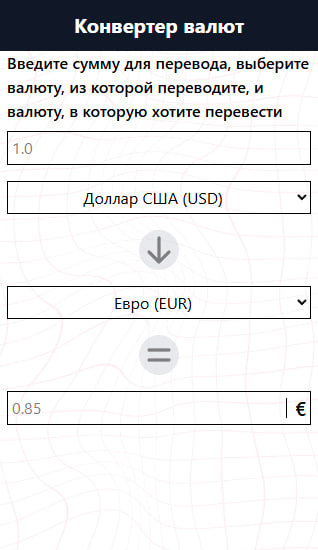
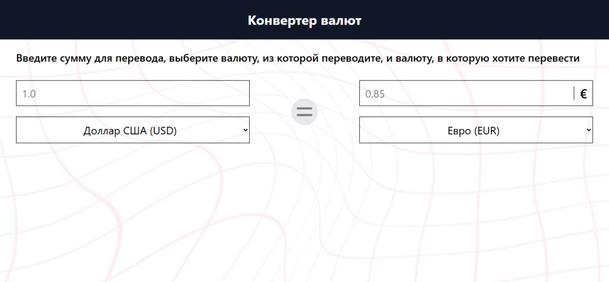

# 💱 React Currency Converter

Простой и удобный конвертер валют на **React + Vite** с использованием TailwindCSS.  
Получает актуальные курсы валют через внешнее API и позволяет быстро пересчитать сумму из одной валюты в другую.

---

## 🚀 Возможности
- Конвертация валют в реальном времени через API.  
- Поддержка популярных валют (USD, EUR, RUB, UZS и др.).  
- Красивый и адаптивный интерфейс (TailwindCSS, grid + flex).  
- Автоматический деплой на **GitHub Pages**.

---

## 🛠️ Технологии
- [React 19](https://react.dev/)  
- [Vite](https://vitejs.dev/)  
- [TailwindCSS](https://tailwindcss.com/)  
- [gh-pages](https://www.npmjs.com/package/gh-pages)  

---

## 📦 Установка и запуск локально
Клонируй репозиторий и установи зависимости:

`git clone https://github.com/anxietysteel/react-currency-converter.git`

`cd react-currency-converter`

`npm install`

---

## Запуск dev-сервера:

`npm run dev`

---

## Сборка проекта:

`npm run build`

---

## 📸 Скриншоты

| Mobile | Desktop |
|--------|---------|
| | |

---

 ## 📜 Лицензия

MIT License. Свободно для использования и модификации.
